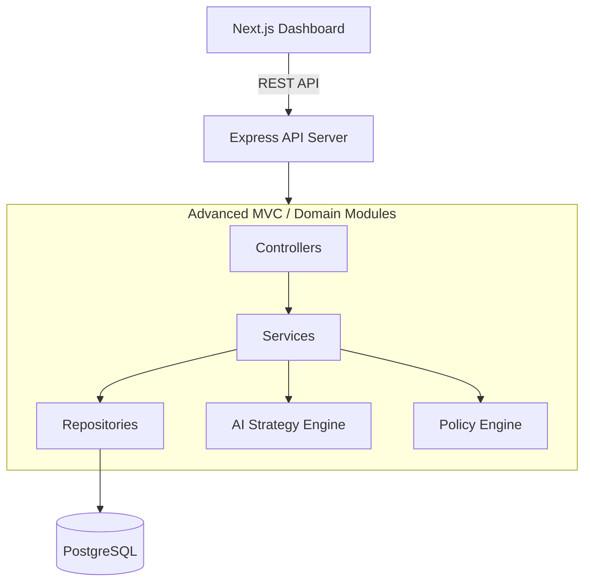

# Architecture Overview

## AI Revenue Recovery Agent

This project follows an **Advanced MVC (Modular Domain-Driven)** architecture. The system is designed to seamlessly integrate deterministic merchant policies with probabilistic AI reasoning, ensuring that AI recommendations are strictly validated before execution.

---

## 1. High-Level System Architecture

The application is split into two primary layers:

- **Client (Frontend):** A Next.js (React) web application providing a premium fintech-style merchant dashboard.
- **Server (Backend):** A Node.js (Express) server structured around domain modules, handling business logic, AI orchestration, and database operations.

---

## 2. Server Architecture (Advanced MVC / Modular)

The backend avoids a monolithic structure and instead organizes code by **domain** under `/server/src/modules/`. This represents an advanced, scalable evolution of MVC:

- **Controllers (The "C" in MVC):** Handle HTTP requests, input validation, and HTTP responses.
- **Services (The "M" logic):** Contain the core business rules. This is where AI integration, policy validation, and action orchestration happen.
- **Repositories (The "M" data access):** Abstract database interactions using Prisma ORM.

### Key Modules:
- `recovery-cases`: Manages the lifecycle of a recovery opportunity.
- `ai-strategy-engine`: Interfaces with the Gemini model to propose recovery actions.
- `policy-engine`: Deterministically validates AI proposals against merchant constraints.
- `action-execution`: Executes the final, approved recovery actions.
- `audit-events`: Records every state change for complete observability.

---

## 3. Client Architecture

The frontend is located at `/client` and is built with **Next.js 16**, **React 19**, and **Tailwind CSS**. 

The UI layer is composed primarily of components in `client/src/components/dashboard/`, orchestrated by `client/src/app/dashboard/page.tsx` (acting as the View Controller).

### Client Layers:
- **Pages/Routes:** Define the high-level views (e.g., `app/dashboard/page.tsx`).
- **Components:** Reusable UI elements (e.g., `RecoveryCasesTable.tsx`, `MetricCards.tsx`) located in `src/components/dashboard/`.
- **API Client:** Centralized data fetching layer at `src/lib/api.ts` to abstract REST calls.

---

## 4. Architectural Principles

1. **Deterministic Execution:** The AI never executes actions directly. It only recommends. The Policy Engine acts as an invariant gatekeeper.
2. **Idempotency:** Action execution and revenue attribution strictly use idempotency keys to prevent duplicate operations.
3. **Auditability:** Every significant state change (AI generation, validation, action execution) is recorded chronologically as an Audit Event.
