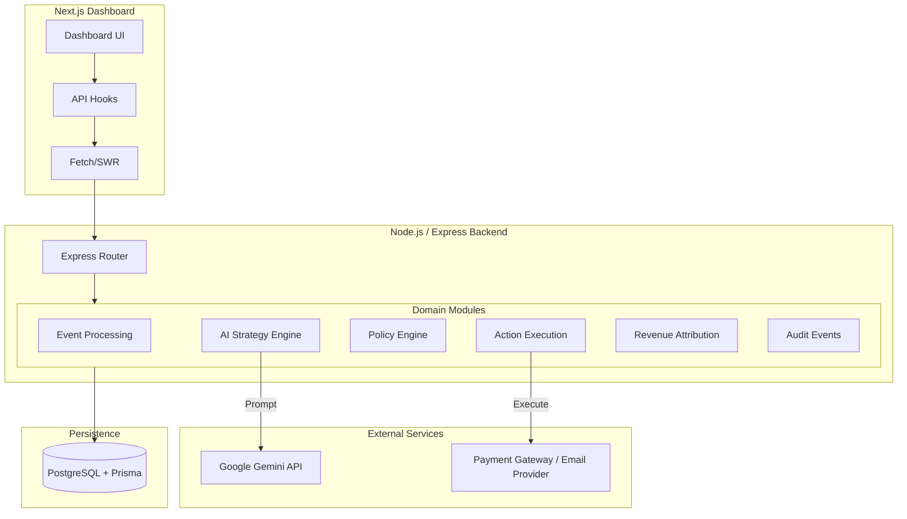

# System Architecture

RevivePay AI is designed with an **Advanced Modular Domain-Driven Architecture**. This ensures that the AI generation layer is strictly decoupled from the deterministic policy and execution layers, which is crucial for financial systems.

## Component Architecture

## Directory Structure
The backend (`server/src/modules/`) is divided into distinct domains:
- **`ai-strategy-engine/`**: Interacts with Gemini to generate strategies based on case context.
- **`policy-engine/`**: Deterministic rule evaluator. Rejects any AI strategy that violates merchant limits (cooldowns, max amounts, max retries).
- **`recovery-cases/`**: Manages the lifecycle and state machine of a recovery opportunity.
- **`revenue-attribution/`**: Links successful outcomes back to the AI strategy that generated them for ROI calculation.
- **`audit-events/`**: The source of truth for the timeline, recording everything immutably.

## The Core Loop (Recovery Orchestrator)
The `recovery-orchestrator` module is the brain that ties the domains together:
1. `processRevenueEvent()`
2. `generateStrategyDecision()`
3. `validateStrategyDecision()`
4. `createRecoveryAction()`
5. `executeRecoveryAction()`
6. `createRevenueAttribution()`
