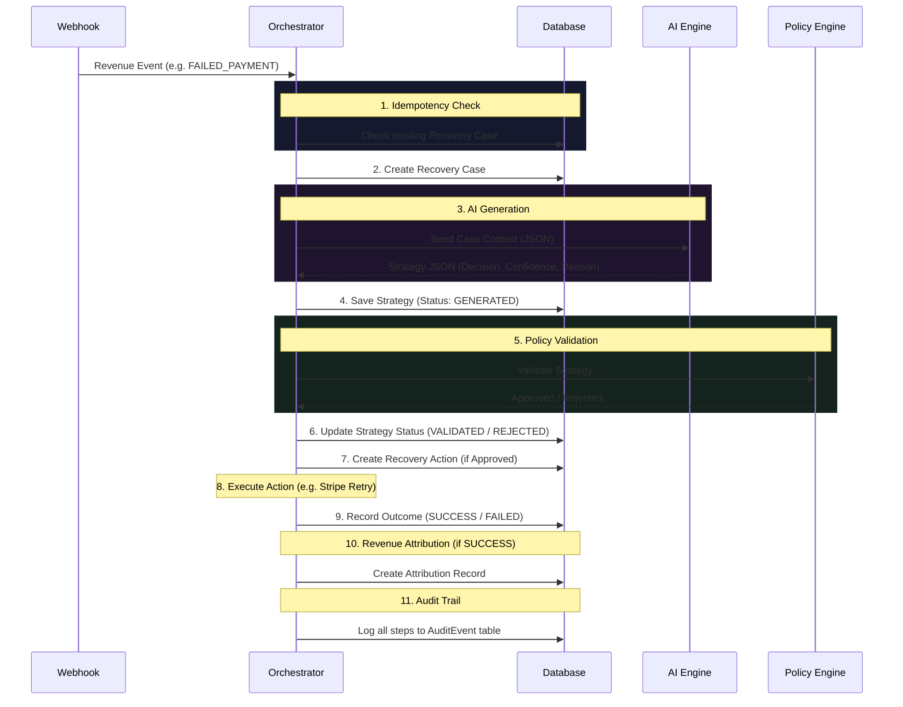

# Recovery Workflows

The system follows a strict, idempotent 11-step pipeline for every revenue event.

```mermaid
sequenceDiagram
    participant Webhook
    participant Orchestrator
    participant Database
    participant AI Engine
    participant Policy Engine
    
    Webhook->>Orchestrator: Revenue Event (e.g. FAILED_PAYMENT)
    
    rect rgb(20, 25, 45)
        Note over Orchestrator,Database: 1. Idempotency Check
        Orchestrator->>Database: Check existing Recovery Case
    end
    
    Orchestrator->>Database: 2. Create Recovery Case
    
    rect rgb(30, 20, 45)
        Note over Orchestrator,AI Engine: 3. AI Generation
        Orchestrator->>AI Engine: Send Case Context (JSON)
        AI Engine-->>Orchestrator: Strategy JSON (Decision, Confidence, Reason)
    end
    
    Orchestrator->>Database: 4. Save Strategy (Status: GENERATED)
    
    rect rgb(20, 35, 30)
        Note over Orchestrator,Policy Engine: 5. Policy Validation
        Orchestrator->>Policy Engine: Validate Strategy
        Policy Engine-->>Orchestrator: Approved / Rejected
    end
    
    Orchestrator->>Database: 6. Update Strategy Status (VALIDATED / REJECTED)
    
    Orchestrator->>Database: 7. Create Recovery Action (if Approved)
    
    Note over Orchestrator: 8. Execute Action (e.g. Stripe Retry)
    
    Orchestrator->>Database: 9. Record Outcome (SUCCESS / FAILED)
    
    Note over Orchestrator,Database: 10. Revenue Attribution (if SUCCESS)
    Orchestrator->>Database: Create Attribution Record
    
    Note over Orchestrator,Database: 11. Audit Trail
    Orchestrator->>Database: Log all steps to AuditEvent table
```
