# Recovery Workflows

> This document describes the complete execution workflows of the RevivePay AI system — from the moment a revenue event is detected to the moment recovered revenue is attributed back to the AI agent.

---

## The Core Recovery Pipeline

Every revenue event, regardless of type, passes through the same 7-stage recovery pipeline. The pipeline is implemented in `server/src/modules/recovery-orchestrator/recovery-orchestrator.service.ts` and is invoked by the `simulate` module for demonstration purposes.

```mermaid
sequenceDiagram
    participant Client as Dashboard / Webhook
    participant Sim as Simulate Service
    participant Orch as Recovery Orchestrator
    participant DB as PostgreSQL (Prisma)
    participant AI as AI Strategy Engine (Gemini)
    participant Policy as Policy Engine
    participant Exec as Action Execution

    Client->>Sim: POST /simulate/scenario { merchantId, eventType, amount, ... }

    Note over Sim: Creates synthetic Transaction<br/>and RevenueEvent with unique ID

    Sim->>DB: INSERT Transaction (if PAYMENT_FAILED)
    Sim->>DB: INSERT RevenueEvent
    Sim->>Orch: orchestrateRecovery(event.id)

    rect rgb(20, 25, 45)
        Note over Orch,DB: Stage 1 — Idempotency Guard
        Orch->>DB: SELECT RecoveryCase WHERE revenueEventId = event.id
        DB-->>Orch: null (new event) or existing case
        alt Already processed
            Orch-->>Client: { status: "ALREADY_PROCESSED" }
        end
    end

    rect rgb(25, 30, 50)
        Note over Orch,DB: Stage 2 — Recovery Case Detection
        Orch->>DB: INSERT RecoveryCase { caseType, priority, riskLevel, estimatedRecovery }
        DB-->>Orch: RecoveryCase { id, ... }
    end

    rect rgb(30, 20, 45)
        Note over Orch,AI: Stage 3 — AI Strategy Generation
        Orch->>AI: generateStrategy({ recoveryCase, customer, merchant })
        Note over AI: Gemini Flash infers optimal action<br/>from case context + merchant config
        AI-->>Orch: { decision, confidence, riskLevel, reason, model }
        Orch->>DB: INSERT AIStrategyDecision { status: "GENERATED" }
    end

    rect rgb(20, 35, 30)
        Note over Orch,Policy: Stage 4 — Policy Validation
        Orch->>Policy: validateDecision(strategyDecision, merchantPolicies)
        Note over Policy: Evaluates: retry limits, cooldown,<br/>value ceiling, time-of-day rules
        Policy-->>Orch: VALIDATED or REJECTED
        Orch->>DB: UPDATE AIStrategyDecision { status: "VALIDATED" | "REJECTED" }
        alt Policy rejected
            Orch-->>Client: { status: "POLICY_REJECTED", ... }
        end
    end

    rect rgb(25, 25, 40)
        Note over Orch,DB: Stage 5 — Recovery Action Creation
        Orch->>DB: INSERT RecoveryAction { actionType, status: "PENDING" }
        DB-->>Orch: RecoveryAction { id, ... }
    end

    rect rgb(20, 30, 25)
        Note over Orch,Exec: Stage 6 — Action Execution
        Orch->>Exec: executeAction(recoveryAction)
        Note over Exec: Simulates: Stripe retry,<br/>email send, SMS dispatch
        Exec-->>Orch: Outcome { status: "RECOVERY_SUCCEEDED" | "RECOVERY_FAILED" }
        Orch->>DB: INSERT Outcome
        Orch->>DB: UPDATE RecoveryAction { status: "COMPLETED" | "FAILED" }
    end

    rect rgb(35, 30, 15)
        Note over Orch,DB: Stage 7 — Revenue Attribution
        alt Outcome is RECOVERY_SUCCEEDED
            Orch->>DB: INSERT RevenueAttribution { amount, attributionType: "FULL_RECOVERY" }
        end
        Orch->>DB: UPDATE RevenueEvent { processedAt: now() }
    end

    Orch-->>Sim: Full pipeline result
    Sim-->>Client: { status, event, recoveryCase, strategyDecision, validatedDecision,<br/>recoveryAction, outcome, attribution, meta: { durationMs, merchantName } }
```



---

## Stage Details

### Stage 1 — Idempotency Guard

**Module:** `recovery-orchestrator`  
**Database:** `SELECT` on `RecoveryCase` by `revenueEventId`

The pipeline immediately checks whether a `RecoveryCase` already exists for this `RevenueEvent`. This protects against:
- Payment gateway webhooks delivered more than once
- Network retries that re-submit the same event
- Batch runner re-processing (each simulation uses a unique `externalEventId`)

**Possible outcomes:**
- `null` → Proceed to Stage 2.
- Existing case → Return `{ status: "ALREADY_PROCESSED" }` immediately.

---

### Stage 2 — Recovery Case Detection

**Module:** `recovery-engine`  
**Database:** `INSERT RecoveryCase`

A `RecoveryCase` is the central entity that tracks the lifecycle of a single recovery opportunity. The case detector determines:

| Input                      | Case Type                  | Priority | Risk Level |
|----------------------------|----------------------------|----------|------------|
| `PAYMENT_FAILED`           | `FAILED_PAYMENT`           | HIGH     | MEDIUM     |
| `CHECKOUT_ABANDONED`       | `CHECKOUT_ABANDONMENT`     | MEDIUM   | LOW        |
| `SUBSCRIPTION_PAYMENT_FAILED` | `SUBSCRIPTION_FAILURE`  | HIGH     | HIGH       |

The `estimatedRecovery` is set to the transaction amount, providing the AI with the financial stakes of the decision.

---

### Stage 3 — AI Strategy Generation

**Module:** `ai-strategy-engine`  
**External:** Google Gemini API (`gemini-2.0-flash`)

The AI receives a structured JSON context (see [AI_USAGE.md](AI_USAGE.md) for the full payload schema) and returns a typed recovery recommendation. The decision is immediately persisted to `AIStrategyDecision` with `status: "GENERATED"`.

**Possible AI decisions:**
| Decision                     | Typical Use Case                         |
|------------------------------|------------------------------------------|
| `RETRY_PAYMENT`              | Transient bank timeout or network error  |
| `SEND_PAYMENT_REMINDER`      | Abandoned checkout, soft failure         |
| `SEND_SUBSCRIPTION_REMINDER` | Subscription lapse, card on file expired |
| `UPDATE_PAYMENT_METHOD`      | Card blocked, permanently declined       |
| `NO_ACTION`                  | High-risk, low-confidence scenario       |
| `ESCALATE_TO_HUMAN`          | Complex edge case, ambiguous signals     |

---

### Stage 4 — Policy Validation

**Module:** `policy-engine`  
**Database:** `UPDATE AIStrategyDecision`

The Policy Engine is a pure, deterministic function. It evaluates the AI's strategy against the merchant's configured policies without any probabilistic reasoning. This stage is completely independent of the AI — a 99% confident AI strategy can be rejected if it violates a merchant rule.

**Policy checks performed (in order):**
1. Is the `decision` within the allowed `actionTypes` for this merchant?
2. Has the maximum retry count been reached?
3. Is the cooldown period still active since the last contact attempt?
4. Does the transaction amount exceed the maximum auto-retry threshold?
5. Is the current time within the allowed contact window?

If any check fails, the decision is marked `REJECTED` and the pipeline terminates with `{ status: "POLICY_REJECTED" }`.

---

### Stage 5 — Recovery Action Creation

**Module:** `recovery-action-engine`  
**Database:** `INSERT RecoveryAction`

If the policy engine validates the strategy, a `RecoveryAction` record is created with `status: "PENDING"`. This record is the execution contract — it contains the `actionType` and all parameters needed for the execution engine to perform the action.

---

### Stage 6 — Action Execution

**Module:** `action-execution`  
**External:** Payment gateways / communication providers (simulated)

The action execution engine processes the `RecoveryAction` and records an `Outcome`. In production, this module integrates with:
- **Stripe / Razorpay**: For `RETRY_PAYMENT` actions (re-charges the stored payment method).
- **SendGrid / AWS SES**: For `SEND_PAYMENT_REMINDER` and `SEND_SUBSCRIPTION_REMINDER` actions.
- **Twilio**: For SMS-based reminder actions.
- **OneSignal / FCM**: For push notification actions.

In demo mode, outcomes are determined by a weighted random function that simulates realistic recovery rates (~60–70% success for CARD retries, ~40% for CHECKOUT reminders).

**Possible outcomes:**
| Status                 | Meaning                                       |
|------------------------|-----------------------------------------------|
| `RECOVERY_SUCCEEDED`   | Action executed; payment or re-engagement confirmed |
| `RECOVERY_FAILED`      | Action executed; customer did not recover     |

---

### Stage 7 — Revenue Attribution

**Module:** `revenue-attribution`  
**Database:** `INSERT RevenueAttribution`, `UPDATE RevenueEvent`

If the outcome is `RECOVERY_SUCCEEDED`, a `RevenueAttribution` record is created, explicitly linking:
- The recovered `amount` and `currency`
- The `RecoveryCase` that identified the opportunity
- The `AIStrategyDecision` that recommended the action
- The `attributionType` (currently `FULL_RECOVERY` for complete payment recovery)

This attribution record is the foundation of the ROI metrics shown on the dashboard.

---

## Event Type Workflow Variants

### PAYMENT_FAILED

```
Webhook → Transaction (FAILED) → RevenueEvent → RecoveryCase (FAILED_PAYMENT)
→ AI: RETRY_PAYMENT / UPDATE_PAYMENT_METHOD
→ Policy: validate retry count + cooldown
→ Action: Stripe retry API call
→ Outcome: SUCCEEDED / FAILED
→ Attribution (if SUCCEEDED)
```

### CHECKOUT_ABANDONED

```
Checkout event → RevenueEvent → RecoveryCase (CHECKOUT_ABANDONMENT)
→ AI: SEND_PAYMENT_REMINDER
→ Policy: validate contact channel + time-of-day
→ Action: Email with cart recovery link
→ Outcome: SUCCEEDED (customer returns) / FAILED
→ Attribution (if SUCCEEDED)
```

### SUBSCRIPTION_PAYMENT_FAILED

```
Subscription webhook → RevenueEvent → RecoveryCase (SUBSCRIPTION_FAILURE)
→ AI: SEND_SUBSCRIPTION_REMINDER / UPDATE_PAYMENT_METHOD
→ Policy: validate plan tier, retry count
→ Action: Email + SMS reminder with payment update link
→ Outcome: SUCCEEDED / FAILED
→ Attribution (if SUCCEEDED)
```

---

## Pipeline Status Reference

| Pipeline Status        | Meaning                                                           |
|------------------------|-------------------------------------------------------------------|
| `ALREADY_PROCESSED`    | Duplicate event; idempotency guard triggered                      |
| `NO_RECOVERY_REQUIRED` | No `RecoveryCase` created (event does not qualify for recovery)   |
| `POLICY_REJECTED`      | AI strategy was valid but rejected by merchant policy rules       |
| `RECOVERY_SUCCEEDED`   | Full pipeline completed; revenue attributed                        |
| `RECOVERY_FAILED`      | Pipeline completed; execution did not result in recovery          |
