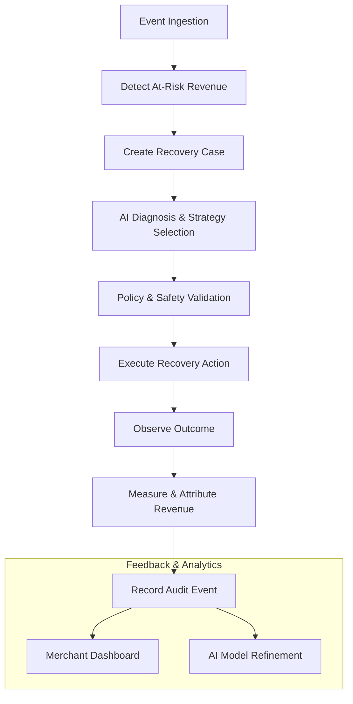

# System Workflows

## Core Closed Loop

The AI Revenue Recovery Agent follows a strict closed-loop lifecycle for every detected failure event.

## Detailed Entity Lifecycle

1. **RevenueEvent:** The initial trigger (e.g., a failed transaction).
2. **RecoveryCase:** An active investigation opened based on the RevenueEvent.
3. **StrategyDecision:** The recommendation proposed by the AI Strategy Engine.
4. **RecoveryAction:** The concrete system action authorized by the Policy Engine.
5. **RecoveryOutcome:** The result of executing the action.
6. **RevenueAttribution:** The financial measurement of revenue successfully recovered.
7. **AuditEvent:** The immutable ledger entry recording all state transitions.
